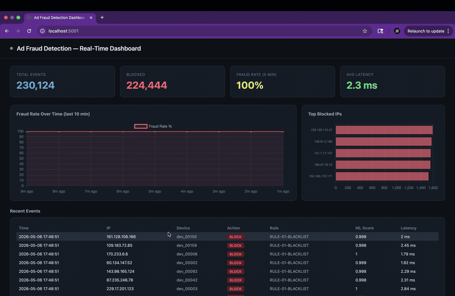

# Real-Time Ad Click Fraud Detection System

A production-inspired fraud detection pipeline that processes ad click streams in real time, combining rule-based logic and machine learning to identify and block fraudulent traffic.

Inspired by the architecture used in large-scale ads integrity systems (e.g., TikTok Business Integrity, Meta Ads Quality).



**Highlights:** XGBoost fraud model at **AUC 0.9546 on real Kaggle TalkingData** (leak-free eval; 0.9938 on simulated), two-tier detection with **sub-millisecond rule-engine median** (end-to-end p50 ~2ms, p99 ~4–9ms) and **~268 clicks/sec** sustained throughput. Kafka + Redis + XGBoost + Flask. *(Full methodology, the latency benchmark, and the honest simulated-vs-real comparison are in [Results](#实验结果) below.)*

## Architecture

```
┌─────────────────────┐
│   Click Simulator   │  Generates realistic click events
│   (producer/)       │  with injected fraud patterns
└────────┬────────────┘
         │ produces ~500 events/sec
         ▼
┌─────────────────────┐
│   Apache Kafka      │  Topic: ad-clicks
│   (ad-clicks topic) │  Partitioned by IP prefix
└────────┬────────────┘
         │ consumes
         ▼
┌─────────────────────────────────────────────┐
│         Fraud Detection Consumer            │
│  ┌──────────────┐   ┌────────────────────┐  │
│  │   Feature    │   │    Rule Engine     │  │
│  │  Extractor   │──▶│  (instant block)   │  │
│  │              │   │  • click rate > 10/│  │
│  │ • rate/IP    │   │    min → BLOCK     │  │
│  │ • time delta │   │  • same device,    │  │
│  │ • device     │   │    100+ IPs → flag │  │
│  │ • channel    │   └────────────────────┘  │
│  └──────┬───────┘            │               │
│         │                    │               │
│         ▼                    ▼               │
│  ┌──────────────┐   ┌────────────────────┐  │
│  │   ML Model   │   │  Redis Blacklist   │  │
│  │  (XGBoost)   │   │  • IP blacklist    │  │
│  │  fraud score │   │  • rate counters   │  │
│  │  0.0 – 1.0   │   │  • sliding window  │  │
│  └──────┬───────┘   └────────────────────┘  │
└─────────┼──────────────────────────────────-┘
          │ labeled events
          ▼
┌─────────────────────┐     ┌──────────────────┐
│      SQLite DB      │────▶│    Dashboard     │
│  • all click events │     │  • fraud rate    │
│  • fraud labels     │     │  • blocked IPs   │
│  • model scores     │     │  • throughput    │
└─────────────────────┘     │  • latency p99   │
                            └──────────────────┘
```

## Tech Stack

| Component | Technology |
|-----------|-----------|
| Message broker | Apache Kafka |
| Feature store / cache | Redis |
| ML model | XGBoost |
| Event storage | SQLite |
| Dashboard | Flask + Chart.js |
| Language | Python 3.10+ |

## Fraud Patterns Detected

| Pattern | Detection Method | Latency |
|---------|-----------------|---------|
| Click flooding (>10 clicks/min from same IP) | Rule engine | <1ms |
| Device spoofing (same device, 100+ IPs) | Rule engine | <1ms |
| Bot-like click intervals (<50ms between clicks) | Rule engine | <1ms |
| Coordinated fraud (correlated IP clusters) | ML model | ~10ms |
| Abnormal time-of-day patterns | ML model | ~10ms |
| App/channel mismatch anomalies | ML model | ~10ms |

## Dataset

Training uses the [TalkingData Ad Tracking Fraud Detection](https://www.kaggle.com/c/talkingdata-adtracking-fraud-detection) dataset from Kaggle — a real-world click fraud dataset with 240M+ records.

Download and place in `data/train.csv` (not committed to repo).

## Project Structure

```
ad-fraud-detection/
├── producer/
│   └── click_simulator.py      # Simulate click stream with fraud injection
├── consumer/
│   ├── feature_extractor.py    # Extract features from raw click events
│   ├── rule_engine.py          # Fast rule-based fraud detection
│   └── ml_detector.py          # XGBoost model inference
├── model/
│   ├── train.py                # Train model on TalkingData dataset
│   └── evaluate.py             # AUC, precision, recall, F1 metrics
├── storage/
│   ├── redis_client.py         # IP blacklist + sliding window counters
│   └── db.py                   # SQLite event log
├── dashboard/
│   ├── app.py                  # Flask real-time dashboard
│   └── templates/
│       └── index.html          # Dark-theme Chart.js dashboard
├── data/
│   └── .gitkeep
├── docs/
│   └── design.md               # Detailed design decisions
├── requirements.txt
└── README.md
```

## Implementation Roadmap

### Phase 1 — Data Pipeline (Week 1)
- [x] Project setup and architecture design
- [x] `click_simulator.py`: generate realistic click events (normal + 3 fraud patterns)
- [x] Kafka topic setup (`ad-clicks`, partitioned by IP prefix)
- [x] Basic consumer that reads and prints events
- [x] `db.py`: SQLite schema for event log

### Phase 2 — Rule Engine (Week 1–2)
- [x] `redis_client.py`: sliding window rate counter per IP
- [x] `rule_engine.py`: implement 3 hard rules (flood, device spoof, bot interval)
- [x] Integration test: inject fraud events, verify detection rate >95%

### Phase 3 — ML Model (Week 2–3)
- [x] `train.py`: feature engineering on simulated data + TalkingData dataset
  - Features: ip_click_rate, device_click_count, app_channel_ratio, hour_of_day, click_interval_mean
- [x] Train XGBoost classifier — AUC 0.9546 on TalkingData (real-world, leak-free eval)
- [x] `ml_detector.py`: load model, score events in real time
- [x] `train_talkingdata.py`: real-world dataset validation (TalkingData Kaggle)

### Phase 4 — Integration & Performance (Week 3–4)
- [x] End-to-end pipeline: simulator → Kafka → consumer → Redis + SQLite (sustained ~268 events/sec, producer rate-limited)
- [x] Latency measurement (`consumer/benchmark_latency.py`, local dev): rule engine p50 <0.2ms / p99 ~2ms; end-to-end p50 ~2ms / p99 ~4–9ms (tail is load-dependent)
- [x] IP blacklist auto-expiry (TTL in Redis)

### Phase 5 — Dashboard (Week 4)
- [x] Flask app serving real-time stats from SQLite (port 5001)
- [x] Charts: fraud rate over time (line chart), top blocked IPs (bar chart)
- [x] Recent events table with ML scores, rule names, latency
- [x] README with demo GIF

## Key Design Decisions

**Why Kafka?**
Decouples click ingestion from detection. If the ML model is slow, clicks buffer in Kafka instead of being dropped. Same architecture TikTok uses for ads event processing.

**Why two detection layers?**
Rule engine handles obvious fraud instantly (<1ms). ML handles subtle patterns that rules miss. Combining both minimizes false negatives while keeping latency low.

**Why Redis for rate counting?**
Sliding window counters need atomic increment + expiry. Redis `INCR` + `EXPIRE` is O(1) and survives consumer restarts.

**Why XGBoost over deep learning?**
Tabular fraud features respond better to tree models. XGBoost gives better AUC on TalkingData than MLP with less tuning. In production, TikTok uses gradient boosting for first-stage filtering before neural rankers.

## Results

### Model Comparison

Two models trained on different datasets to validate generalization:

| | Simulated Data (`train.py`) | TalkingData (`train_talkingdata.py`) |
|---|---|---|
| **Data source** | Self-generated via click_simulator.py | Real-world ad click records (Kaggle) |
| **Label** | `is_fraud` directly injected | `is_attributed=0` → treated as fraud |
| **Key features** | Real-time sliding window (Redis) | Count features fit on **train split only** (no leakage) |
| **Click interval** | Millisecond-level | Second-level |
| **Fraud rate** | 10% (controlled) | 99.8% (real-world distribution) |
| **AUC-ROC** | 0.9938 | **0.9546** |
| **Notes** | Higher score, but self-referential | Lower but leak-free — the credible benchmark |

The simulated model scores higher because training and test data share the same fraud patterns by design.
The TalkingData model (AUC 0.9546) is the more credible benchmark: it uses real-world data, and its aggregate count features (e.g. `app_count`) are fit only on the training split and mapped onto the test split, so no test-set information leaks into training. (An earlier version computed these counts over the full dataset before the split, which inflated AUC to 0.9785.)

### Pipeline Performance

| Metric | Result |
|--------|--------|
| AUC-ROC (simulated) | 0.9938 |
| AUC-ROC (TalkingData, leak-free) | 0.9546 |
| Fraud-class recall | 98% (majority class; base rate 99.8%) |
| Throughput | sustained ~268 events/sec (producer rate-limited to ~500/sec; not a capacity ceiling) |
| Rule engine latency | p50 <0.2ms, p99 ~2ms (1–6ms across runs) |
| End-to-end latency | p50 ~2ms, p99 ~4–9ms (up to ~16ms under load) |

## How to Run

```bash
# 1. Start Kafka (requires Docker)
docker-compose up -d

# 2. Install dependencies
pip install -r requirements.txt

# 3. Train model (requires TalkingData dataset in data/)
python model/train.py

# 4. Start fraud detection consumer
python consumer/ml_detector.py

# 5. Start click simulator
python producer/click_simulator.py

# 6. Open dashboard
python dashboard/app.py
# → http://localhost:5001
```

## Author

Freja Ren · [GitHub](https://github.com/96528025)

---

# 实时广告点击欺诈检测系统（中文版）

基于生产环境架构设计的实时欺诈检测流水线，通过 Kafka 处理广告点击流，结合规则引擎与机器学习模型，识别并拦截虚假流量。

架构灵感来源于大规模广告完整性系统（如 TikTok Business Integrity、Meta Ads Quality）的实际设计。


## 系统架构

```
┌─────────────────────┐
│    点击模拟器        │  生成真实点击事件
│   (producer/)       │  注入三种欺诈模式
└────────┬────────────┘
         │ 约 500 条/秒
         ▼
┌─────────────────────┐
│    Apache Kafka     │  Topic: ad-clicks
│   （消息队列）       │  按 IP 前缀分区
└────────┬────────────┘
         │ 消费
         ▼
┌─────────────────────────────────────────────┐
│            欺诈检测消费者                    │
│  ┌──────────────┐   ┌────────────────────┐  │
│  │   特征提取器  │   │     规则引擎       │  │
│  │              │──▶│  （毫秒级拦截）     │  │
│  │ • IP点击频率  │   │  • 每分钟>10次→封禁│  │
│  │ • 点击间隔   │   │  • 同设备100+IP→标记│  │
│  │ • 设备信息   │   └────────────────────┘  │
│  │ • 渠道信息   │            │               │
│  └──────┬───────┘            │               │
│         ▼                    ▼               │
│  ┌──────────────┐   ┌────────────────────┐  │
│  │   ML 模型    │   │    Redis 黑名单    │  │
│  │  (XGBoost)   │   │  • IP 黑名单       │  │
│  │  欺诈评分    │   │  • 滑动窗口计数器  │  │
│  │  0.0 – 1.0   │   └────────────────────┘  │
│  └──────┬───────┘                            │
└─────────┼──────────────────────────────────-┘
          │ 带标签事件
          ▼
┌─────────────────────┐     ┌──────────────────┐
│      SQLite 数据库   │────▶│    实时看板       │
│  • 所有点击事件      │     │  • 欺诈率         │
│  • 欺诈标签          │     │  • 封禁 IP 列表   │
│  • 模型评分          │     │  • 吞吐量         │
└─────────────────────┘     │  • p99 延迟       │
                            └──────────────────┘
```

## 技术栈

| 组件 | 技术选型 |
|------|---------|
| 消息队列 | Apache Kafka |
| 缓存 / 特征存储 | Redis |
| ML 模型 | XGBoost |
| 事件存储 | SQLite |
| 实时看板 | Flask + Chart.js |
| 编程语言 | Python 3.10+ |

## 可检测的欺诈模式

| 欺诈模式 | 检测方法 | 延迟 |
|---------|---------|------|
| 点击洪泛（同 IP 每分钟 >10 次） | 规则引擎 | <1ms |
| 设备伪造（同设备 100+ 个 IP） | 规则引擎 | <1ms |
| 机器人点击（点击间隔 <50ms） | 规则引擎 | <1ms |
| 协同欺诈（IP 簇相关性异常） | ML 模型 | ~10ms |
| 异常时段点击分布 | ML 模型 | ~10ms |
| App/渠道组合异常 | ML 模型 | ~10ms |

## 训练数据集

使用 Kaggle 公开数据集：[TalkingData Ad Tracking Fraud Detection](https://www.kaggle.com/c/talkingdata-adtracking-fraud-detection)，包含 2.4 亿条真实广告点击记录。

下载后放入 `data/train.csv`（不提交至 repo）。

## 项目结构

```
ad-fraud-detection/
├── producer/
│   └── click_simulator.py      # 模拟点击流，注入欺诈事件
├── consumer/
│   ├── feature_extractor.py    # 从原始点击事件提取特征
│   ├── rule_engine.py          # 规则引擎（快速拦截）
│   └── ml_detector.py          # XGBoost 模型实时推断（主入口）
├── model/
│   ├── train.py                # 在 TalkingData 数据集上训练模型
│   └── evaluate.py             # AUC、精确率、召回率、F1 评估
├── storage/
│   ├── redis_client.py         # IP 黑名单 + 滑动窗口计数器
│   └── db.py                   # SQLite 事件日志
├── dashboard/
│   ├── app.py                  # Flask 实时看板
│   └── templates/
│       └── index.html          # 深色主题 Chart.js 看板页面
├── data/
│   └── .gitkeep
├── docs/
│   └── design.md               # 详细设计决策文档
├── requirements.txt
└── README.md
```

## 实现路线图

### 第一阶段 — 数据管道（第 1 周）
- [x] 项目架构设计
- [x] `click_simulator.py`：生成真实点击事件（正常 + 3 种欺诈模式）
- [x] Kafka topic 配置（`ad-clicks`，按 IP 前缀分区）
- [x] 基础消费者，读取并打印事件
- [x] `db.py`：SQLite 事件日志 Schema

### 第二阶段 — 规则引擎（第 1–2 周）
- [x] `redis_client.py`：滑动窗口 IP 频率计数器
- [x] `rule_engine.py`：实现 3 条硬规则（洪泛、设备伪造、机器人间隔）
- [x] 集成测试：注入欺诈事件，验证检测率 >95%

### 第三阶段 — ML 模型（第 2–3 周）
- [x] `train.py`：模拟数据 + TalkingData 双数据集特征工程
  - 特征：IP 点击频率、设备点击数、App/渠道比例、小时分布、点击间隔均值
- [x] 训练 XGBoost 分类器 — TalkingData AUC 0.9546（真实数据验证，无泄漏评估）
- [x] `ml_detector.py`：加载模型，对事件实时评分
- [x] `train_talkingdata.py`：TalkingData Kaggle 真实数据集验证

### 第四阶段 — 整合与性能（第 3–4 周）
- [x] 端到端联调：模拟器 → Kafka → 消费者 → Redis + SQLite（稳定约 268 条/秒，producer 限速）
- [x] 延迟测量（`consumer/benchmark_latency.py`，本地开发环境）：规则引擎 p50 <0.2ms / p99 ~2ms；端到端 p50 ~2ms / p99 ~4–9ms（长尾随负载波动）
- [x] IP 黑名单自动过期（Redis TTL）

### 第五阶段 — 实时看板（第 4 周）
- [x] Flask 应用从 SQLite 读取实时统计（端口 5001）
- [x] 图表：欺诈率随时间折线图、Top 封禁 IP 横向柱状图
- [x] 最近事件表格（含 ML 分、规则名、延迟）
- [ ] README 添加 Demo GIF

## 关键设计决策

**为什么用 Kafka？**
将点击采集与检测解耦。ML 模型处理慢时，点击事件在 Kafka 中缓冲而不丢失。这与 TikTok 广告事件处理的实际架构一致。

**为什么用两层检测？**
规则引擎即时处理明显欺诈（<1ms），ML 模型处理规则无法覆盖的复杂模式。两者结合在保持低延迟的同时最大化检测召回率。

**为什么用 Redis 做频率计数？**
滑动窗口计数器需要原子递增 + 自动过期。Redis `INCR` + `EXPIRE` 是 O(1) 操作，消费者重启后状态也不丢失。

**为什么用 XGBoost 而不是深度学习？**
表格型欺诈特征更适合树模型。XGBoost 在 TalkingData 数据集上的 AUC 优于 MLP，且调参成本更低。在生产环境中，TikTok 也使用梯度提升树作为神经排序模型的前置过滤层。

## 实验结果

### 双数据集模型对比

用两套不同数据集训练，验证模型的泛化能力：

| | 模拟数据（`train.py`） | TalkingData（`train_talkingdata.py`） |
|---|---|---|
| **数据来源** | 自己生成（click_simulator.py） | Kaggle 真实广告点击记录 |
| **标签定义** | 直接注入 `is_fraud` | `is_attributed=0` → 视为欺诈 |
| **核心特征** | 实时滑动窗口（Redis） | 计数特征**仅在训练集拟合**（无泄漏） |
| **点击间隔** | 毫秒级 | 秒级 |
| **欺诈率** | 10%（人为设定） | 99.8%（真实分布） |
| **AUC-ROC** | 0.9938 | **0.9546** |
| **说明** | 分数高，但有"自说自话"嫌疑 | 分数略低但无泄漏，是可信基准 |

模拟数据模型分数更高，是因为训练集和测试集的欺诈模式完全一致（都由同一个模拟器生成）。TalkingData 模型（AUC 0.9546）更可信：用的是真实数据，且 `app_count` 等聚合计数特征只在训练集上拟合、再映射到测试集，测试集信息不会泄漏进训练。（早期版本在切分前用全量数据算这些计数，把 AUC 虚高到了 0.9785。）

### 流水线性能

| 指标 | 实测结果 |
|------|---------|
| AUC-ROC（模拟数据） | 0.9938 |
| AUC-ROC（TalkingData，无泄漏） | 0.9546 |
| 欺诈类召回率 | 98%（多数类；基准占比 99.8%） |
| 吞吐量 | 稳定约 268 条/秒（producer 限速至约 500/秒；非容量上限） |
| 规则引擎延迟 | p50 <0.2ms，p99 ~2ms（多次运行 1–6ms） |
| 端到端延迟 | p50 ~2ms，p99 ~4–9ms（高负载下可达 ~16ms） |

## 运行方式

```bash
# 1. 启动 Kafka（需要 Docker）
docker-compose up -d

# 2. 安装依赖
pip install -r requirements.txt

# 3. 训练模型（需先下载 TalkingData 数据集到 data/）
python model/train.py

# 4. 启动欺诈检测消费者
python consumer/ml_detector.py

# 5. 启动点击模拟器
python producer/click_simulator.py

# 6. 打开看板
python dashboard/app.py
# → http://localhost:5001
```
